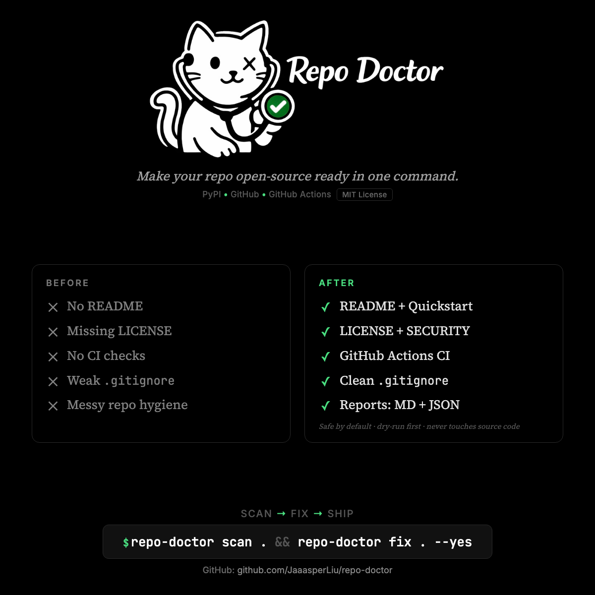

<p align="center">
  
</p>

<p align="center">
  <a href="https://pypi.org/project/repo-doctor/"></a>
  <a href="https://github.com/JaaasperLiu/repo-doctor/actions/workflows/ci.yml"></a>
  <a href="https://pypi.org/project/repo-doctor/"></a>
  <a href="LICENSE"></a>
</p>

<p align="center"><em>Turn any repository into an open-source-ready, professional repo in one command.</em></p>

Repo Doctor scans your Git repository, scores it against 17 open-source best-practice rules, and auto-generates any missing files including README, LICENSE, CI workflow, CONTRIBUTING, CODE_OF_CONDUCT, SECURITY policy, and .gitignore, without ever touching your source code.

## Demo

<p align="center">
  
</p>

## Install

```bash
# From PyPI (recommended)
pipx install repo-doctor

# Or with uv
uv tool install repo-doctor
```

<details>
<summary>Development install (from source)</summary>

```bash
pipx install git+https://github.com/JaaasperLiu/repo-doctor.git
# or
uv tool install git+https://github.com/JaaasperLiu/repo-doctor.git
```

</details>

## Quickstart

```bash
# Scan a repo and get a health score + report
repo-doctor scan /path/to/repo

# Preview what would be fixed (no files written)
repo-doctor fix --dry-run /path/to/repo

# Fix issues automatically
repo-doctor fix --yes /path/to/repo

# Generate a config file
repo-doctor init
```

## What it checks

17 rules across 6 categories:

| Category | Rules | Auto-fixable |
|----------|-------|:---:|
| **Basics** | README present, README has key sections, LICENSE present | 2 of 3 |
| **Community** | CONTRIBUTING, CODE_OF_CONDUCT, SECURITY policy | 3 of 3 |
| **Build** | CI pipeline, test command, linter configured | 1 of 3 |
| **Hygiene** | .gitignore present, .gitignore coverage, no venv/caches, repo size | 2 of 4 |
| **Security** | No secret files (.env, .pem, id_rsa), no high-entropy strings | 0 of 2 |
| **Reproducibility** | Lockfile present, dependencies pinned | 0 of 2 |

Each rule produces a **pass/fail**, a **severity** (error/warn/info), and a **weight** toward the 0-100 score. Grade thresholds: A (90+), B (75+), C (55+), D (<55).

### Rule reference

| Rule ID | Description | Severity | Weight | Auto-fix |
|---------|-------------|----------|--------|:--------:|
| `readme_exists` | README file present | error | 15 | Yes |
| `readme_sections` | README has Install + Usage sections | warn | 5 | — |
| `license_exists` | LICENSE file present | error | 12 | Yes |
| `contributing_exists` | CONTRIBUTING guide present | warn | 6 | Yes |
| `code_of_conduct_exists` | CODE_OF_CONDUCT present | warn | 5 | Yes |
| `security_policy` | SECURITY policy present | warn | 5 | Yes |
| `ci_workflow` | CI/CD pipeline exists | error | 10 | Yes |
| `test_command` | Test command discoverable | warn | 5 | — |
| `lint_config` | Linter configured | info | 3 | — |
| `gitignore_exists` | .gitignore present | error | 8 | Yes |
| `gitignore_coverage` | .gitignore covers common junk | warn | 4 | Yes |
| `no_venv_committed` | No venv/node_modules committed | error | 5 | — |
| `repo_size` | Reasonable repo size (<100 MB) | info | 3 | — |
| `no_secrets` | No .env/.pem/id_rsa files committed | error | 8 | — |
| `no_high_entropy` | No high-entropy strings (potential secrets) | info | 3 | — |
| `lockfile_exists` | Lockfile present for detected stack | warn | 5 | — |
| `pinned_deps` | Dependencies have version constraints | info | 3 | — |

Use `--only` and `--skip` with these IDs:

```bash
repo-doctor scan --only readme_exists --only license_exists
repo-doctor scan --skip lint_config --skip pinned_deps
```

## How fixes work

Repo Doctor is **safe by default**:

1. Scans and identifies failing auto-fixable rules
2. Builds a **ChangePlan** (list of files to create or patch)
3. Shows a **rich diff preview** of every file
4. Only writes files after you confirm (or use `--yes`)
5. Re-scans and shows the score improvement

Guarantees:
- Never deletes files
- Never modifies your source code
- Only generates meta-files (README, LICENSE, CI, etc.)
- Templates are **stack-aware** — a Python repo gets `pytest` in CI, a Node repo gets `npm test`

## Detected stacks

Repo Doctor auto-detects your project type and tailors templates accordingly:

| Stack | Detected by |
|-------|-------------|
| Python | `pyproject.toml`, `setup.py`, `requirements.txt`, `Pipfile` |
| Node | `package.json`, `package-lock.json`, `yarn.lock` |
| Rust | `Cargo.toml` |
| Go | `go.mod` |
| Swift | `Package.swift`, `*.xcodeproj`, `*.swift` |

## CLI Reference

```
repo-doctor scan [PATH]     Scan and produce a health report
repo-doctor fix [PATH]      Auto-generate missing files
repo-doctor init [PATH]     Create a .repo-doctor.yml config
```

### Key flags

| Flag | Description |
|------|-------------|
| `--dry-run` | Preview changes without writing files |
| `--yes`, `-y` | Apply changes without confirmation |
| `--strict` | Exit with code 1 if any warnings/errors |
| `--format` | Output format: `md`, `json`, or `both` (default) |
| `--only RULE` | Only run specific rule(s) |
| `--skip RULE` | Skip specific rule(s) |
| `--license` | License type: `mit` (default) or `apache-2.0` |
| `--output-dir`, `-o` | Output directory for reports (default: repo root) |

## Output files

After scanning, Repo Doctor writes:

- `repo-doctor.report.md` — Human-readable report
- `repo-doctor.report.json` — Machine-readable report (for CI)
- `repo-doctor.changes.md` — Summary of applied/planned changes

Use `--output-dir` to keep your repo clean:

```bash
repo-doctor scan --output-dir .repo-doctor
```

## Config

If `.repo-doctor.yml` exists in your repo root, Repo Doctor loads it automatically. CLI flags override config values.

Create one with `repo-doctor init`, or write it manually:

```yaml
project_name: my-project
license: mit
ci: github-actions
readme: standard
output_dir: .repo-doctor
skip:
  - lint_config
  - pinned_deps
```

## Use in CI (GitHub Action)

Add Repo Doctor to your GitHub Actions workflow:

```yaml
- name: Repo Doctor
  uses: JaaasperLiu/repo-doctor/action@v0
  with:
    strict: true  # fail the build if issues are found
```

The action posts the full report to the GitHub Actions summary and exports `score` and `grade` as outputs:

```yaml
- name: Repo Doctor
  id: doctor
  uses: JaaasperLiu/repo-doctor/action@v0

- name: Check score
  run: echo "Score is ${{ steps.doctor.outputs.score }}"
```

### Action inputs

| Input | Default | Description |
|-------|---------|-------------|
| `path` | `.` | Path to scan |
| `strict` | `false` | Fail if warnings/errors found |
| `skip` | | Comma-separated rule IDs to skip |
| `only` | | Comma-separated rule IDs to run |
| `format` | `both` | Report format |

## Development

```bash
git clone https://github.com/JaaasperLiu/repo-doctor.git
cd repo-doctor
uv sync --dev
uv run pytest -x -v        # run tests (79 tests)
uv run ruff check src/     # run linter
uv run repo-doctor scan .  # scan itself (scores 100/100)
```

## Contributing

See [CONTRIBUTING.md](CONTRIBUTING.md) for guidelines, including how to add new rules.

## License

MIT
